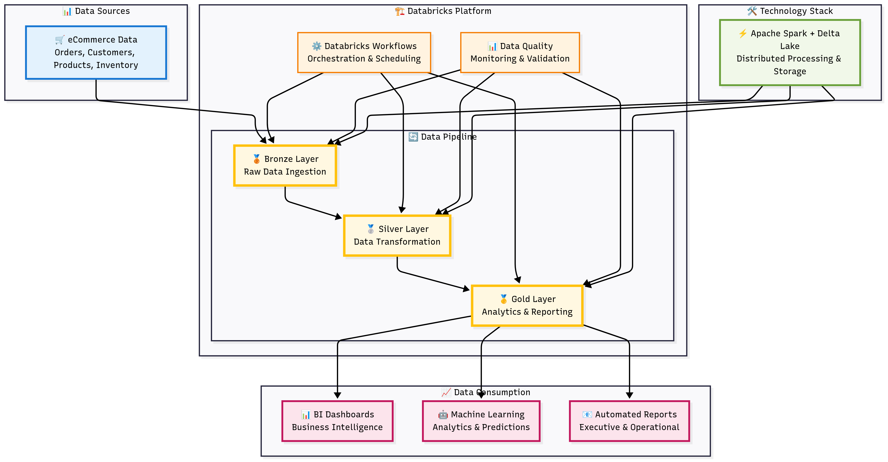

# 🛒 eCommerce Data Engineering Pipeline with Databricks Workflows

## 📌 Project Overview

This project demonstrates a complete data engineering pipeline for an eCommerce platform using **Databricks Workflows**. It covers the ingestion, transformation, and orchestration of data from raw sources to curated analytics-ready datasets.

## 🎯 Objectives

- Ingest raw eCommerce data (orders, customers, products, etc.)  
  _Note: This project uses **Databricks Community Edition**, which does not support external cloud storage integrations (e.g., AWS S3, Azure Blob). Therefore, raw data is manually uploaded to the Databricks File System (DBFS) and ingested into the Bronze layer._
- Perform data cleaning and transformation using PySpark
- Implement a medallion architecture (Bronze → Silver → Gold)
- Schedule and orchestrate workflows using Databricks Workflows
- Enable downstream analytics and reporting

 ## Databricks Data Pipeline Architecture



## 📄 Project Description

This project simulates a real-world eCommerce data engineering pipeline built on Databricks, leveraging Apache Spark, Delta Lake, and Databricks Workflows to manage and orchestrate data processing tasks.

The pipeline follows the **medallion architecture** pattern:

- **Bronze Layer**: Raw data ingestion from manually uploaded CSV files
- **Silver Layer**: Data cleansing, normalization, and joining
- **Gold Layer**: Aggregated, business-ready datasets for analytics and reporting

The pipeline is modular, scalable, and production-ready. It demonstrates how to:

- Automate data ingestion and transformation using Databricks notebooks
- Schedule and monitor workflows using Databricks Workflows
- Use Delta Lake for versioned, ACID-compliant data storage
- Enable downstream use cases such as BI dashboards, reporting, and machine learning

## 🗂️ Project Structure
```ecommerce-pipeline-databricks/
├── notebooks/
│   ├── 01_ingest_raw_data.py                     # Ingests manually uploaded raw data into the Bronze layer
│   ├── 02_transform_bronze_to_silver.py          # Cleans and transforms Bronze data into Silver
│   └── 03_transform_silver_to_gold_and_report.py # Aggregates Silver data into Gold and generates reports
│
├── workflows/
│   └── ecommerce_pipeline_workflow.json          # Reference JSON for Databricks Workflow (not executable)
│
├── data/
│   ├── bronze/                                   # Raw ingested data stored as CSV files
│   ├── silver/                                   # Cleaned and joined data
│   └── gold/                                     # Aggregated and analytics-ready data
│
└── README.md                                     # Project documentation```
